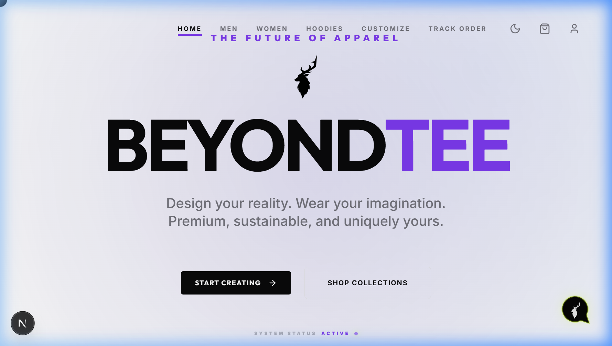
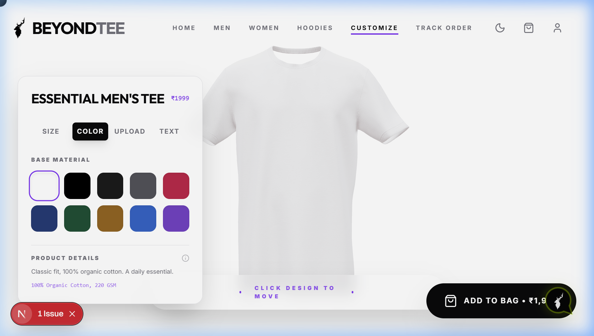
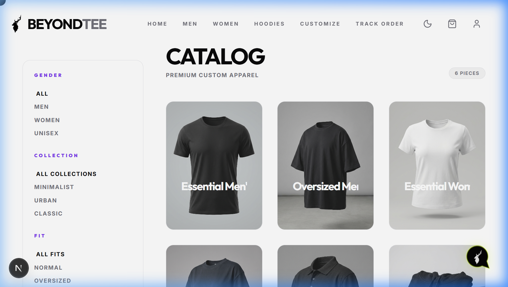
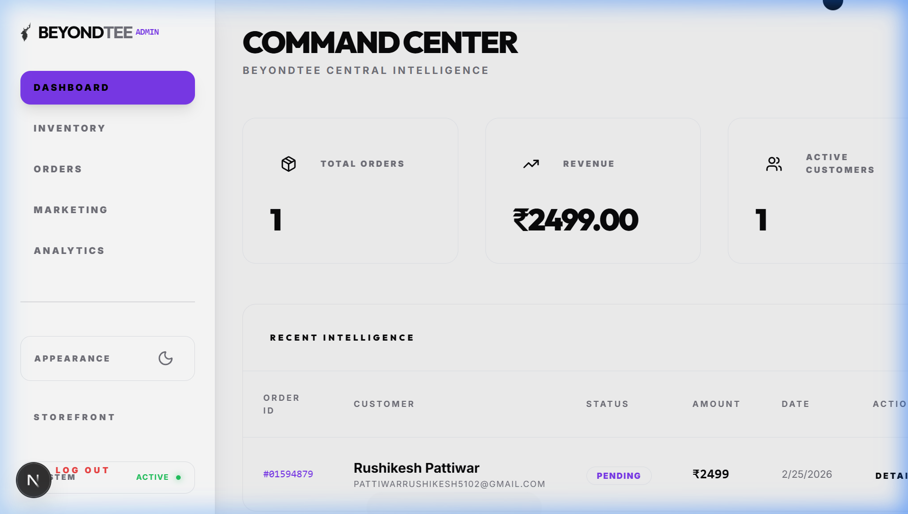

# 👕 BeyondTee - Next-Gen 3D Custom Apparel Platform

<div align="center">

[](https://nextjs.org/)
[](https://nestjs.com/)
[](https://threejs.org/)
[](https://www.prisma.io/)
[](https://tailwindcss.com/)
[](https://www.docker.com/)

**BeyondTee** is a premium, production-ready full-stack e-commerce solution that empowers users to customize casual wear (T-shirts, hoodies, and more) in an immersive, real-time 3D editor. Built with a robust monorepo architecture leveraging Next.js, NestJS, and Three.js.

[✨ Live Preview](#) | [🎬 Watch Demo Video](#) | [🚀 Deployment Guide](#-deployment--hosting)

</div>

---

## 🔮 Key Features

### 🛍️ Client & 3D Customizer
*   **Immersive 3D Customizer Studio**: Real-time interactive 3D apparel editor using React Three Fiber. Users can rotate, zoom, and decorate custom models (T-shirts, hoodies) dynamically.
*   **Smart Layering Engine**: Add multiple decorative decals, custom typography, change colors, and scale/reposition layers on the fly.
*   **Premium E-Commerce Flow**: Intelligent search and filter sidebar (by Fit, Collection, Gender), seamless cart management, secure checkout, and real-time public order tracking.
*   **Vibrant User Experience**: Enhanced UI with custom cursors, scroll reveal animations, glassmorphism elements, and fully responsive layouts.

### 🏢 Operations & Admin Panel
*   **Live Analytics Dashboard**: Real-time telemetry tracking gross revenue, orders, stock levels, and user registration analytics.
*   **Order & Logistics Manager**: Granular order tracking where admins can view specific 3D custom design configurations, transaction receipts, and customer details.
*   **Marketing Engine**: Easily create, validate, and manage promotional coupon codes (percentage discount or flat-rate deductions).
*   **Client-Side Security**: Integrated Next-Auth credential check paired with NestJS JWT guards to enforce secure, role-based authorization for admin layouts.

---

## 🖼️ Application Preview

<table width="100%">
  <tr>
    <td width="50%" align="center">
      <b>✨ Interactive Landing Page</b><br/>
      
    </td>
    <td width="50%" align="center">
      <b>🔮 3D Customizer Studio</b><br/>
      
    </td>
  </tr>
  <tr>
    <td width="50%" align="center">
      <b>🛍️ Product Catalogue & Shop</b><br/>
      
    </td>
    <td width="50%" align="center">
      <b>📊 Admin Analytics Dashboard</b><br/>
      
    </td>
  </tr>
</table>

---

## 🛠️ Local Development & Setup

### Prerequisites
Ensure you have the following installed on your machine:
*   [Node.js](https://nodejs.org/) (Version 18 or higher)
*   [Git](https://git-scm.com/)
*   [Docker Desktop](https://www.docker.com/products/docker-desktop/) *(Optional, for containerized run)*

---

### 1. NestJS Backend Setup

Navigate into the `backend` workspace and spin up the development API:

```bash
# 1. Navigate to the backend directory
cd backend

# 2. Install dependencies
npm install

# 3. Setup environment variables (Create .env based on .env.example)
# Add keys for JWT, Stripe, Cloudinary, AWS S3
cp .env.example .env

# 4. Generate Prisma client & initialize database (SQLite by default)
npx prisma generate
npx prisma migrate dev --name init

# 5. Seed the product catalog
npm run prisma:seed    # Seeds the database with products and admin user

# 6. Start NestJS server in watch mode
npm run start:dev
```
*The backend API will boot up on [http://localhost:3001](http://localhost:3001)*

---

### 2. Next.js Frontend Setup

Navigate to the `web` workspace and run the client-side server:

```bash
# 1. Navigate to the web directory
cd ../web

# 2. Install dependencies
npm install

# 3. Setup client environment variables
# Ensure NEXT_PUBLIC_API_URL points to http://localhost:3001
cp .env.local.example .env.local

# 4. Start Next.js development server
npm run dev
```
*Open your browser and visit [http://localhost:3000](http://localhost:3000)*

---

### 🔐 Default Credentials
*   **Admin Panel Email**: `admin`
*   **Admin Panel Password**: `admin`
*   Sign-in is accessible via [http://localhost:3000/auth/signin](http://localhost:3000/auth/signin)

---

## 🚀 Deployment & Hosting

The stack is fully containerized and production-ready. You can build the stack using Docker or host it directly on a Hostinger VPS.

### Option A: Quick Production Test (Docker Compose)
To run the full backend, frontend, and database locally in production containers:
1. Edit `backend/prisma/schema.prisma` to switch the database provider to `postgresql` (or use a managed PostgreSQL service).
2. Spin up the containers using the production file:
   ```bash
   docker-compose -f docker-compose.prod.yml up --build -d
   ```

---

### Option B: Hostinger VPS Deployment (Ubuntu 22.04 / 24.04)

Deploy the system directly on a Hostinger VPS with Nginx, Nginx Proxy, and Let's Encrypt SSL.

#### Step 1: Connect to Server (SSH)
Connect to your Hostinger VPS via terminal:
```bash
ssh root@YOUR_VPS_IP_ADDRESS
```

#### Step 2: Install Docker & Git
Install the application prerequisites:
```bash
# Update server
sudo apt update && sudo apt upgrade -y

# Install Git
sudo apt install git -y

# Install Docker & Docker Compose
sudo apt install docker.io docker-compose -y
sudo systemctl enable docker
sudo systemctl start docker
```

#### Step 3: Clone Code & Add Environment Config
Clone the repository and set up environment files:
```bash
cd /var/www
git clone https://github.com/Rushikesh5102/BeyondTee.git
cd BeyondTee

# Configure Backend
nano backend/.env
# (Paste database URL, Cloudinary secrets, Hostinger SMTP info. Ctrl+X, Y, Enter)

# Configure Frontend
nano web/.env.local
# (Paste production backend URL NEXT_PUBLIC_API_URL and nextauth configurations. Ctrl+X, Y, Enter)
```

#### Step 4: Run Application
Boot up the stack in detached background mode:
```bash
sudo docker-compose -f docker-compose.prod.yml up --build -d
```
Verify container status:
```bash
sudo docker ps
```

#### Step 5: Route Traffic & Add SSL (Nginx & Certbot)
Set up Nginx as a reverse proxy:
```bash
# Install Nginx and SSL tools
sudo apt install nginx -y
sudo apt install certbot python3-certbot-nginx -y

# Configure Nginx proxy rules
sudo nano /etc/nginx/sites-available/beyondtee
```
Paste this configuration (replace `yourdomain.in` with your domain):
```nginx
server {
    server_name yourdomain.in www.yourdomain.in;

    # Route /api traffic to the NestJS Backend (Port 3001)
    location /api/ {
        proxy_pass http://localhost:3001/;
        proxy_http_version 1.1;
        proxy_set_header Upgrade $http_upgrade;
        proxy_set_header Connection 'upgrade';
        proxy_set_header Host $host;
        proxy_cache_bypass $http_upgrade;
    }

    # Route all other traffic to the Next.js Frontend (Port 3000)
    location / {
        proxy_pass http://localhost:3000;
        proxy_http_version 1.1;
        proxy_set_header Upgrade $http_upgrade;
        proxy_set_header Connection 'upgrade';
        proxy_set_header Host $host;
        proxy_cache_bypass $http_upgrade;
    }
}
```
Enable the configurations and restart Nginx:
```bash
sudo ln -s /etc/nginx/sites-available/beyondtee /etc/nginx/sites-enabled/
sudo nginx -t
sudo systemctl restart nginx
```
Obtain a free SSL certificate for secure HTTPS:
```bash
sudo certbot --nginx -d yourdomain.in -d www.yourdomain.in
```

---

## 🏛️ Project Structure
```
Beyondtee/
├── backend/            # NestJS backend API
│   ├── prisma/         # Database schemas and seeds
│   ├── src/            # Core application source code
│   └── Dockerfile      # Backend deployment container
├── web/                # Next.js customizer client
│   ├── public/         # Static assets and icons
│   ├── src/            # Next.js pages & React components
│   └── Dockerfile      # Frontend deployment container
├── docs/               # Screenshots and assets
└── docker-compose.yml  # Local stack orchestration
```

---
<div align="center">
  <sub>Built with ❤️ by Rushikesh Pattiwar</sub>
</div>
